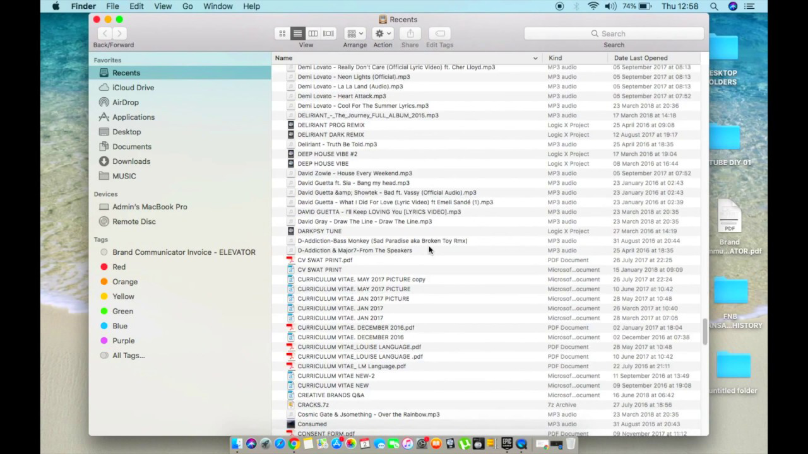
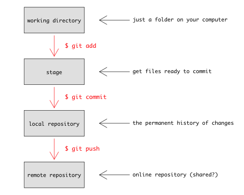
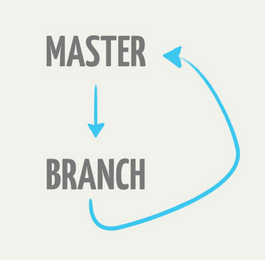

--- 
title: "Organised, transparent and reproducible science using R, git, and drake"
author: "D Barneche"
site: bookdown::bookdown_site
output:
    bookdown::pdf_book:
        includes:
            in_header: header.tex
    bookdown::gitbook:
        config:
            sharing: null
        css: 'style.css'
        includes:
            in_header: _toggle.html
        keep_md: TRUE
linkcolor: blue
documentclass: book
link-citations: yes
description: "Organised, transparent and reproducible science using R, git, and drake"
---

# How to organise your project directories

```{r, child = "_setup.Rmd", include = F, purl = F, cache = F}
```

The scientific process is naturally incremental, and many projects
start life as random notes, some code, then a manuscript, and
eventually everything is a bit mixed together.

<!-- more -->

<blockquote class="twitter-tweet" data-lang="en"><p lang="en" dir="ltr">Managing your projects in a reproducible fashion doesn&#39;t just make your science reproducible, it makes your life easier.</p>&mdash; Vince Buffalo (@vsbuffalo) <a href="https://twitter.com/vsbuffalo/status/323638476153167872?ref_src=twsrc%5Etfw">April 15, 2013</a></blockquote>
<script async src="https://platform.twitter.com/widgets.js" charset="utf-8"></script>

## Directory layout

### The general disaster

Many people tend to organise their projects like this:



There are many reasons why we should *ALWAYS* avoid this:

1. It is really hard to tell what version of your data is
the original and what is the modified;
2. It gets really messy because it mixes files with various
extensions together;
3. It probably takes you a lot of time to actually find
things, and relate the correct figures to the exact code
that has been used to generate it;
4. You may face professional embarrassment when sharing your
project directory with a colleague or your supervisor.

### A niceR solution

A good project layout helps ensure the

* Integrity of data
* Portability of the project
* Easier to pick the project back up after a break

There is no one way to lay a project out. We have
different approaches for different projects, reflecting the history of
the project, who else is collaborating on that project.

Here are a couple of different ideas for laying a project out.  This
is the basic structure that I tend to use:

```
proj/
|-- R/
|-- data/
|-- output/
|-- |-- data/
|-- |-- figures/
|-- doc/
```

* The `R` directory contains various files with function definitions
  (but *only* function definitions - no code that actually runs).

* The `data` directory contains data used in the analysis.  This is
  treated as *read only*; in particular the R files are never allowed
  to write to the files in here.  Depending on the project, these
  might be csv files, a database, and the directory itself may have
  subdirectories.

* The `output/data` directory contains simulation output, processed
  datasets, logs, or other processed things. The `output/figures`
  directory contains the output figures generated by your code.
  Altogether the `output` directory *only contains generated files*;
  that is, I should always be able to delete the contents and regenerate them.

* The `doc` directory contains the paper. I work in Markdown which is
  nice because it can pick up figures directly made by R. Markdown
  is starting to get traction among biologists. With Word you'll have
  to paste them in yourself as the figures update.

In this set up, I usually have the R script files that *do* things in
the project root:

```
proj/
|-- R/
|-- data/
|-- output/
|-- |-- data/
|-- |-- figures/
|-- doc/
|-- analysis.R
```

For very simple projects, you might drop the R directory, perhaps
replacing it with a single file `analysis-functions.R` which you
`source` within the .R files that depend on the outputs.

The top of the analysis file usually looks something like

```r
library(some_package)
library(some_other_package)
source("R/functions.R")
source("R/utilities.R")
```

...followed by the code that loads the data, cleans it up, runs the
analysis and generates the figures.

Other people have other ideas

* [Carl Boettiger](http://www.carlboettiger.info/2012/05/06/research-workflow.html)
  is an open science advocate who has described his
  [layout in detail](http://www.carlboettiger.info/2012/05/06/research-workflow.html).
  This layout uses R packages for most of the code organisation, and
  would be a nice approach for large projects.

* [This article](http://www.ploscompbiol.org/article/info%3Adoi%2F10.1371%2Fjournal.pcbi.1000424)
  in [PLOS Computational Biology](http://www.ploscompbiol.org/)
  describes a general framework.

### Treat data as read only

This is probably the most important goal of setting up a
project. Data are typically time consuming and/or expensive to
collect. Working with them interactively (e.g., in Excel) where they
can be modified means you are never sure of where the data came from,
or how they have been modified. We suggest to put your data
into the `data` directory and treat it as *read only*. Within your
scripts you might generate derived data sets either temporarily (in an
R session only) or semi-permanently (as a file in `output/data`), but
the original data is always left in an untouched state.

### Treat generated output as disposable

In this approach, files in directory `output/` are all generated
by the scripts.  A nice thing about this approach is that if
the file names of generated files change (e.g, changing from
`phylogeny.pdf` to `mammal-phylogeny.pdf`) files with the old names
may still stick around, but because they're in this directory you know
you can always delete them. Before submitting a paper, I will go
through and delete all the generated files and rerun the analysis to
make sure that I can create all the analyses and figures from the
data.

### Separate function definition and application

When your project is new and shiny, the script file usually contains
many lines of directly executed code. As it matures, reusable
chunks get pulled into their own functions. The actual analysis
scripts then become relatively short, and use the functions defined in
scripts in `R`. Those scripts do nothing but define functions so that
they can always be `source()`'d by the analysis scripts.

## Setting up a project in RStudio

This gets rid of the #1 problem with most people's projects face;
where do you find the data. Two solutions people generally come up
with are:

1. Hard code the full file name for each file you load (e.g.,
`/Users/barneche/phd/ctotpaper/data/some_data.csv`)
2. Set the working directory at the beginning of your script file
`/Users/barneche/phd/ctotpaper/` then doing `read.csv("data/some_data.csv")`

The second of these is probably preferable to the first, because the
"special case" part is restricted to just one line in your file.
However, the project is still now quite fragile, because moving it
from one place to another, you must change this file. Some examples
of when you might do this:

* Archiving a project (moving it from a "current projects" directory
  to a new projects directory)
* Giving the code to somebody else (your lab mate, collaborator, supervisor)
* Uploading the code with your manuscript submission for review, or to
  [Dryad](http://datadryad.org/) after acceptance.
* New computer and new directory layout (especially changing
  platforms, or if your previous mess got too bad and you wanted to
  clean up).
* Any number of new reasons

The second case hints at a solution too; if we can start R in a
particular directory then we can just use paths *relative to the
project root* and have everything work nicely.

To create a project in R studio:

  - "File": "New Project..."
  - choose "New Directory (start a project in a brand new working directory)".
  - Under "Project Type", choose "New Project".
  - In the "Directory name" type the name for the project.  This might
    be `chapter_n` for a thesis, or something more descriptive like
    `fish_behaviour`.
  - In the "Create project as a subdirectory of" field select (type or
    browse) for the parent directory of the project. By default this
    is probably your home directory, but you might prefer your
    Documents folder.

# Version control

## Why use version control?

There are many reasons to use version control, and some of these may only become apparent after you have incorporated it into your workflow (it's a bit like "why use R" or "why document your code").  However, we can immediately  identify a set of advantages that are very common.

Most of these come from having **a fossil record that captures the evolution of your project** (including code, data, documentation, analyses, figures, talks, etc).

This fossil record, or project history, is a series of revisions that connect to each other between the present and the start of the project.  At any time you can go back to previous versions, see what you did, and run the code as though you have stepped back in time.

Having a good fossil history has numerous possible uses :

1. **You noticed that your code is doing odd things now and didn't used to.** Look at and run a version from the last known good code and try to work out what changed (after this, you should write a unit test!).

2. **You deleted some code and want to get it back.**  This has a less obvious, but much more common (and perhaps more important) advantage; you will be more likely to delete old code rather than commenting it out, leaving you with shorter, more readable scripts.

3. **You want to show your supervisor what you did last week.**

4. Inversely, on a collaborative project, **see what your collaborators wrote last week.**

5. You reformatted everything from numbered citation styles to author-year after being rejected from journal A and sending your paper to journal B.  Journal B didn't want the paper anyway, so you can **get the previous version back.**

6. **You want to experiment** and try something that might break huge pieces of your project, and know that you can back out if things go awry.

7. Similarly, **you want to try a couple of different strategies for solving a problem** and review which one you like best (or show them to someone else).

8. Gives you **an audit-able project history**; you know when you did what you did.

The other great reason for using version control is that it allows for effective and transparent collaboration among small or large groups of scientists.

### You are already using version control

Whether you recognise it or not, you are most likely already using some form of version control to achieve some of the advantages outlined above. This might include

* Commented out bits of code / text
* Files with numbers afterwards (`thesis_v1.doc`, `thesis_v2.doc`, `thesis_final.doc`, `thesis_final2.doc`, etc) (like in this [Phd Comic](http://www.phdcomics.com/comics/archive.php?comicid=1531))
* Every so often you zip up the whole project directory and save it with the date appended to the filename.

Most ecologists we know have adopted at least one of these techniques for doing version control.

In addition, you'll often see people suggesting putting headers like this in your code file:

```
  ## My file (c) John Snow
  ## Created: 2018/10/04
  ## Modified: 2019/04/04
```

Sometimes you'll even see change logs embedded in these.

The problem with this is that it's repetitive and boring, it's difficult to extract the information easily (e.g., get me all the files **I** modified in the last month), there is no checking on the contents of the fields (dates in the future, forgetting to update dates, inconsistent names, email addresses).  The *point* of these headers is nice --- keep track of who did what and when, but this is far easier to achieve under a good version control system.

Another thing you'll find in many people's code is large chunks of old code, commented-out because you think you might need it it again one day.

### Version control is not a back up

It appears that this is like a brilliant backup system, but you need a
backup too.  Backing up is a complementary set of functions that
overlap only in that there is usually some history going back.

* Back up but not git: corruption of repository, generated files that are not part of a repository but time consuming, installed software and other system issues.  It is possible (but often hard) to break your git repository; you might reclone from somewhere or you might grab the last copy of a backup.  Backup systems usually have larger capacity than online version control systems.

* Git but not backup: semantics around files, parallel branched versions of files, check out by either checkpoint or time (not just last time, etc).

A good version control system does not substitute for a good backup system. *Backing up* offers a complementary set of functions that only partially overlap with those offered by version control. In general, you need both.

I have all my projects under version control, and my whole documents directory under backup.  If my computer fails, I immediately copy my documents directory from the backup to a new computer.  I only need to get the last version though.  On the other hand, at any time I can easily look back through the history of any project and see the work.  For some projects, the last modification was months ago, while most backup system will be seriously thinning by this point (moving to monthly snapshots at best, and you probably have to pay for that).

Other systems, like Dropbox, are more like backups, as they do not store your project history.

## Basic git configuration

Please make sure you [download and install git](https://git-scm.com/downloads) first. When we use git on a new computer for the first time, we need to configure a few things. Below are a few examples of configurations we will set as we get started with git:

* our name and email address,

* what our preferred text editor is,

* and that we want to use these settings globally (i.e. for every project).

On a command line, git commands are written as `git verb options`, where `verb` is what we actually want to do and `options` is additional optional information which may be needed for the `verb`. So here is how John Snow sets up his new laptop:

    $ git config --global user.name "John Snow"
    
    $ git config --global user.email "j.snow@email.com"

    $ git config --global color.ui "auto"

Please use your own name and email address instead of John Snow's. If it returns no errors, then verify that these settings were saved into your configuration file (`.gitconfig`) by running:

    $ git config --list

    $ git config user.name

This user name and email will be associated with your subsequent git activity, which means that any changes pushed to any git host server (e.g. [GitHub](http://github.com/), [BitBucket](https://bitbucket.org/), [GitLab](https://about.gitlab.com/)) in a later lesson will include this information.

For these lessons, we will be interacting with GitHub and so the email address used should be the same as the one used when setting up your GitHub account. If you are concerned about privacy, please review [GitHub's instructions for keeping your email address private](https://help.github.com/articles/keeping-your-email-address-private/).

### Keeping your email private

If you elect to use a private email address with GitHub, then use that same email address for the `user.email` value, e.g. `username@users.noreply.github.com` replacing `username` with your GitHub one.

### Line Endings

As with other keys, when you hit Return/Enter on your keyboard, your computer encodes this input as a character. Different operating systems use different character(s) to represent the end of a line. (You may also hear these referred to as newlines or line breaks.) Because git uses these characters to compare files, it may cause unexpected issues when editing a file on different machines. Though it is beyond the scope of this lesson, you can read more about this issue on this [GitHub page](https://help.github.com/articles/dealing-with-line-endings/).

You can change the way git recognises and encodes line endings using the `core.autocrlf` command to `git config`. The following settings are recommended:

On macOS and Linux:

    $ git config --global core.autocrlf input

And on Windows:

    $ git config --global core.autocrlf true

### Configure your text editor

The simple editor `nano` is likely to be the simplest thing to use (at least on a Mac).

    $ git config --global core.editor "nano --tempfile" 

The default is `vi`.  If anyone ends up with a screen does not seem to respond to anything they type, you may have activated vi.  Put your hand up and we'll help you out.

Other options:
* "gedit -w -s" 
* "kate"
* "subl -n -w' for Sublime Text 2.

###  Other editors 

On Windows using Notepad++ in the standard location for a 64-bit machine, you would use:

    $ git config --global core.editor "'C:/Program Files (x86)/Notepad++/notepad++.exe' -multiInst -notabbar -nosession -noPlugin"

(thanks to [StackOverflow](http://stackoverflow.com/questions/1634161/how-do-i-use-notepad-or-other-with-msysgit/2486342#2486342)  for that useful tip)

On Mac, with TextWrangler if you installed TextWrangler's command line tools
then you should have an "edit" command. So you can use the git command:

    $  git config --global core.editor "edit -w"

## Git basics

Essentially, all version control does is store snapshots of your work
in time, and keeps track of the parent-child relationships.

\newline


You can think of your current set of working files as simply the
child of the last node in this chain (that is, your files are the
children of the most recent set of files known to the version control
system).

`git` provides a large number of tools for manipulating this history.
We'll only touch on a few, but the number that you need to know for
day-to-day use is actually quite small.

First, we're going to need some terminology:

* **Repository**: "Repo" for short; this is a copy of the history of
  your project.  It is **stored in a hidden directory within your
    project**.  People will talk about "cloning a repo" or "adding things
  to a repo"; these all manipulate the history in some way.
* **Working directory**: This is your copy of a project.  It's just a
  directory with files and other directories in it.  The repository is
  contained within a `.git` directory at the root directory of your
  project.

One of the distinguishing and great features about git is that the repo contains the entire history of the project, i.e. if your project moves, the history travels with it. So if you clone your work to a new computer, or a collaborator gets involved (more on how to do that later), they have the full project history available.  This is called [distributed version control](https://en.wikipedia.org/wiki/Distributed_version_control).

### What goes in my repository? 

You should establish a new repo for each project you are working on. Your project folder should contain everything related to a particular project, including inputs (data, images, notes), analysis scripts and outputs (figures, tables.) The content of your project will evolve over time and this will be tracked within the git repo.

But not all of your project folder contents will be stored within the git system. As a general guide, we suggest you make a folder called `output` (see the section on [Treat generated output as disposable](#treat-generated-output-as-disposable)). This is where you should save figures and other outputs from your analysis scripts. These outputs do not need to be tracked, as they can be reproduced at any time by rerunning the script. Later we'll show you how to `ignore` certain files in git.

### The commit cycle

Your project develops as you do work. During this process you make a series of 
small changes such as

- writing some code 
- importing/entering  new data
- reorganising your files
- making a figure
- writing bits of reports or papers.

The idea with git is that you break up your project activity into a series of small tasks, each corresponding to a 'commit'. So the cycle goes

> Checkout project --> do work --> review changes --> commit

Anecdotal evidence suggests experienced programmers break up their project into lots of small pieces, and have lots of commits in their work cycle, while novices tend to have fewer, larger commits. some of the advantages of small commits are

- helps you to focus on one small piece of a much larger puzzle
- it's easier to recover if something goes wrong
- you have a greater sense of achievement. 

If you're trucking along for hours (or days) at a time without committing anything, chances are you're changing too much.  A good way of thinking about version control is like the ability to press "undo" when writing.  You don't know when you'll need to go back (and most of the time you don't need to).  But when you do, you don't want to have to have to choose between two vastly different copies of a document.  With programming it's even more important; multiple files that depend on each other are changing.
 
You should aim to only commit once a piece of code works, so that you
leave your code in working order:  commits serve as checkpoints where individual files or an entire project can be safely reverted to when necessary.

### Creating a repository

If you want to create a repository from the command line, use the
command

```
git init
```

which will print something like

```
Initialized empty Git repository in /path/to/your/repository/.git/
```

The `.git` directory is a *hidden directory*.  You can view it with `ls -a`, but it will be hidden with just `ls`.  This store some configuration settings, but you'll rarely need to edit them directly.  It also stores all the previous versions of your working directory (but does it in all sorts of clever and efficient ways).

Every git repository should contain a hidden file that indicates to the system which files or folders should be ignored in our repository---this is called `.gitignore`. Remember our `output/` folder (see the section on [Treat generated output as disposable](#treat-generated-output-as-disposable)) that should only contain files that are generated from code and therefore do not need to be tracked? This is perfect for this situation because we do not want to track any data or figures that can be reproduced again from code. RStudio creates a `.gitignore` by default, and already adds a few RStudio files that will not need to be tracked over time. If you are not using RStudio, please create this file manually and save it to your root directory. Then add `output/` to it, and save it.

### The add-commit cycle

We will use a few commands.

The first is `git status`.  This tells you the status of all the files in your project that *are not up to date*.  At the moment, it contains:

```
# On branch master
# 
# No commits yet
# 
# Untracked files:
#   (use "git add <file>..." to include in what will be committed)
# 
#   .gitignore
#   data/
#   gapminder.Rproj
# 
# nothing added to commit but untracked files present (use "git add" to track)
```

The command `git add` indicates which files we want to add:

```
git add data/
git status
# On branch master
# 
# No commits yet
# 
# Changes to be committed:
#   (use "git rm --cached <file>..." to unstage)
# 
#   new file:   data/gapminder-FiveYearData.csv
# 
# Untracked files:
#   (use "git add <file>..." to include in what will be committed)
# 
#   .gitignore
#   gapminder.Rproj
```

This tells us all of the things that we are going to commit (files in `data/`) and the files that git does not know about (`.gitignore` and `gapminder.Rproj`). The command `git commit` does the actual addition. The `-m` option passes in a message for the commit.

```
git commit -m "Added gapminder raw data."
```

which prints

```
# [master (root-commit) 9fe17d4] Added gapminder raw data.
#  1 file changed, 1705 insertions(+)
#  create mode 100755 data/gapminder-FiveYearData.csv
```

which is essentially the same information that RStudio showed after committing.

We can add the other files:

```
git add .gitignore gapminder.Rproj
git commit -m "Added ignore and RStudio files"
```

which will print 

```
# [master (root-commit) eb2d68d] Added ignore and RStudio files
#  2 files changed, 14 insertions(+)
#  create mode 100644 .gitignore
#  create mode 100644 gapminder.Rproj
```

To clarify what is going on, look at this figure



You use `git add` to tell git what content you want it to track (new files, or changes to files that it already knows about) and then `git commit` to add that content to the repository. For now, don't worry about the last section (`git push`)---that lets you keep the content of your local repository in sync with a repository on another computer, or on a hosting website like [GitHub](http://github.com). We'll cover this on our lesson about using GitHub.

### History

To see the history

```
git log
```

which will print something like

```
# commit eb2d68dc34acd76fb30009ae9e5ddd65e35033eb (HEAD -> master)
# Author: John Snow <j.snow@email.com>
# Date:   Tue Oct 15 13:13:15 2019 +0100
# 
#     Added ignore and RStudio files
# 
# commit 9fe17d47788f1364a7ebb620a303689588398e5f
# Author: John Snow <j.snow@email.com>
# Date:   Tue Oct 15 13:12:37 2019 +0100
# 
#     Added gapminder raw data.
```

#### What is going on with those crazy strings of numbers?

You may have noticed the long strings of numbers, such as:

```
commit eb2d68dc34acd76fb30009ae9e5ddd65e35033eb
```

These are called "hashes"; think of them as a fingerprint of a file, or of a commit.  Git uses them everywhere, so these get used where you would otherwise use "version1", or "final", etc.

The nice thing about them is that they depend on the entire history of a project, so you know that your history is secure. For example, I deleted the full stop at the end of the first commit message ([don't ask me how](http://stackoverflow.com/a/2119656)) and reran `git log`

```
# commit a0f9f692319eb7103bd0485181b45c3bf229851f (HEAD -> master)
# Author: John Snow <j.snow@email.com>
# Date:   Tue Oct 15 13:13:15 2019 +0100
# 
#     Added ignore and RStudio files
# 
# commit 9b5f828a285577d53dc40a28fa3cd7e4cc1a691d
# Author: John Snow <j.snow@email.com>
# Date:   Tue Oct 15 13:12:37 2019 +0100
# 
#     Added gapminder raw data.
```

You might expect that the hash for the first commit would change, but notice that it is has changed a *lot* for just one character difference. Also notice that the second commit has a new hash too; this is because one of the "things" in the second commit is a pointer back to the first commit indicating who its parent is.

Confused?  Don't worry.  All you need to know is that the hash identifies your **entire project including its history**, and that if anything changes anything in the project, the hashes will change.  This is great because it allows us to use the big ugly strings of letters and numbers as a shortcut for a very precise set of information.

#### What changed?

There are lots of ways of seeing what has changed. Probably too many, and the options get overwhelming.  Later on, we'll look at a website that makes that a lot easier for previous versions.

Being able to see what has changed is incredibly useful, and once you start thinking with version control you'll constantly look to see what has changed. The confidence that you can always go back is what makes version control empowering.

Suppose we create a `R/analyses.R` file containing our very first function to read some data:

```
file_read  <-  function (fileName, ...) {
    read.csv(fileName, header = TRUE, stringsAsFactors = FALSE, ...)
}
```

we'll see that `git status` reports that there is a new untracked file:

```
# On branch master
# Untracked files:
#   (use "git add <file>..." to include in what will be committed)
# 
#   R/
# 
# nothing added to commit but untracked files present (use "git add" to track)
```

Suppose we `add` and `commit` the file, 

```
git add R/
git commit -m "added functions files to read and analyse data"
```

and then decide to change it:

```
file_read  <-  function (fileName, ...) {
    read.csv(fileName, header = TRUE, stringsAsFactors = FALSE, strip.white = TRUE, ...)
}
```

we'll see that `git status` reports that the file has changed:

```
# On branch master
# Changes not staged for commit:
#   (use "git add <file>..." to update what will be committed)
#   (use "git checkout -- <file>..." to discard changes in working directory)
# 
#   modified:   R/analyses.R
# 
# no changes added to commit (use "git add" and/or "git commit -a")
```

The command `git diff` shows the change between the contents of the working directory and the changes that would be committed. So with nothing to commit, this is the difference between the files in the directory and the last revision.  Running `git diff` reports:

```
# diff --git a/R/analyses.R b/R/analyses.R
# index 688a1e1..6035676 100644
# --- a/R/analyses.R
# +++ b/R/analyses.R
# @@ -1,4 +1,4 @@
#  file_read  <-  function (fileName, ...) {
# -    read.csv(fileName, header = TRUE, stringsAsFactors = FALSE, ...)
# +    read.csv(fileName, header = TRUE, stringsAsFactors = FALSE, strip.white = TRUE, ...)
#  }
```

if we add the file to "stage" it with:

```
git add R/analyses.R
```

and rerun `git diff`, there is no output. The command `git status` now reports

```
# On branch master
# Changes to be committed:
#   (use "git reset HEAD <file>..." to unstage)
# 
#   modified:   R/analyses.R
# 
```

indicating that `R/analyses.R` will be added when we do `git commit`.  You can review what would be committed line-by-line by running

```
git diff --cached
```

which compares the contents of the staged changes with the previous version.

### Looking at the history

Lots of different ways of looking at the history. A very few useful ones (See this [link](https://git-scm.com/docs/git-log) for full documentation):

* git log --oneline --topo-order --graph --decorate
* git log --since=1day
* git log --since=1week --until=1day
* git log --stat --since=1week --until=1day
* git log -3 # last three commits

## Branching

A linear history is fine, but that is often not how science progresses.

Suppose that you've got your project working, but want to get tidy it up a bit in a way that requires major surgery and you want to be able to get back to where you were.

Alternatively, suppose that you want to try two different ways of implementing something.

In my case, I have a package that I maintain---sometimes I need to add bug fixes to the released version without wanting to publish the broken development code.

What if you wanted to go back to an old version and continue development from there?

In all of these scenarios, we might want to work on a "branch" of the project.

### What do branches look like?

Suppose that we have a repository with three commits: `C0`, `C1` and `C2`:


at the moment there is only one branch: "`master`".  Now imagine that
we're going to do some work starting at this point---we'll create a
new branch that starts from our current point (`C2`), in this case
called `iss53` (the diagrams come from the excellent
[Pro Git](http://git-scm.com/book) book, and I've not redrawn them---
for an ecologist this might be "experiment" or "reorganise_data").


We then continue to do work on this new branch:


At this point, we might be happy with the new work and just want to
merge the branches back together (moving the `master` pointer up to
`C3`).  

Alternatively, you might have to do some work on `master` (perhaps
your supervisor needs you to tweak a figure for a talk they are giving
*right now*, but your current state on `iss53` would break it).  You
could then switch back to branch `master` and do some more work there
too:


(Note that the `iss53` branch has been renamed `experiment` here!)
Now you your history has diverged---both commits `C3` and `C4` have
`C2` as a parent, but they consist of different work.  You have a
choice of how you want to resolve the diverge this to get the work
done on `C3` and `C4` onto the same branch.  First you can **merge**
the changes together:


this means that `C5` has two parents (`C3` and `C4`) and that it
includes the content of both.

Alternatively there is a strategy called **rebase** where we would
replay the changes on the `experiment` branch on the `master` branch,
which gives a linear history:


What this does is to look at the difference between `C3` and `C2`, and
then apply that difference to `C4` so that the new commit `C3'`
contains the results of `C4` and `C3`.  The old `C3` commit is then
dropped.

Note that the **contents** of `C3'` and `C5` will likely be the same
at the end of these two operations---the difference is in the
interpretation of how they came into being.

### Workflows that use branches

Branches most naturally appear in a project that is simultaneously
being worked on by different people.  It turns out the git will see
branches in someone else's repository essentially like branches in
your own, and lots of cool ways of working with branches become
possible.

They also are important for single-user workflows.  I use them for
testing ideas that I'm not sure about:

* Create a branch
* Commit a bunch of work to it
* Decide if I like the work and if so...
* Merge it back into the main branch

This idea is nicely formalised in
[this flow chart](http://nakedstartup.com/2010/04/simple-daily-git-workflow).




Much more complicated (but powerful in the right hands) workflows are
possible, such as the so-called
[git-flow](http://nvie.com/posts/a-successful-git-branching-model/)
workflow.

### Listing branches

The command `git branch` lists the branches git knows about.  By
default, there is only one branch and it is called `master`.

```
git branch
* master
```

The asterisk next to this indicates that this is the *current* branch.
If you pass in the `-v` argument (for **verbose**), you get

```
git branch -v
* master eb2d68d Added ignore and RStudio files
```

which adds the shortened version of the SHA hash and the last commit
message.

### Creating branches

There are two ways of creating branches in git.  The first is to use
`git branch`.  The command 

```
git branch new_idea
```

creates a new branch called `new_idea`, but does not change to it.
Rerunning `git branch -v`:

```
* master   eb2d68d Added ignore and RStudio files
  new_idea eb2d68d Added ignore and RStudio files
```

We now have two branches, both at the same point on the tree.  The
asterisk indicates that we are on the branch `master`.

You can change to a branch by using `git checkout`.  So to switch to
the `new_idea` branch, you would do:

```
git checkout new_idea
```

which lets you know that it worked

```
Switched to branch 'new_idea'
```

You can switch back to master by doing

```
git checkout master
Switched to branch 'master'
```

and can delete branches by passing `-d` to `git branch`

```
git branch -d new_idea
```

which prints

```
Deleted branch new_idea (was eb2d68d).
```

The other way of creating a branch and switching to it is to pass `-b`
as an argument to checkout:

```
git checkout -b new_idea
Switched to a new branch 'new_idea'
```

Now `git branch` shows:

```
  master
* new_idea
```

as we both *created* and *switched to* the new branch `new_idea`.

### How branches grow

New work is commited to the current active branch (the one with the
asterisk next to it in `git branch` (at the moment this is the branch
`new_idea`.  So if we edit a file and do `git commit`.

```
# ...edit file...
git add R/analyses.R
git commit -m "Modified function to make NA treatment optional"
```

The history is now equivalent to this picture from before:


You can also see a picture of this with some arguments to `git log`:

```
git log --graph --decorate --pretty=oneline --abbrev-commit
* 37485b1 (HEAD, new_idea) Modified function to make NA treatment optional
* eb2d68d (master) Added ignore and RStudio files
* 9fe17d4 Added gapminder raw data.
```

(which will even be in colour if you [set that up](#basic-git-configuration)).

### Merging branches back together

Suppose that you are happy with the changes that you made and want to
merge them into your `master` branch.

To do the merge, you first check the `master` branch back out:

```
git checkout master
```

which will output

```
Switched to branch 'master'
```

then

```
git merge new_idea
```

which, for instance, would output something like

```
Updating a0f9f69..37485b1
Fast-forward
 R/analyses.R | 3 +-
 1 file changed, 3 insertions(+), 2 deletions(-)
```

telling you that `master` was "fast-forwarded" from `a0f9f69` to
`37485b1`, changing one file (`R/analyses.R`) by inserting three lines and
deleting two.

The tree now has two branches that "point" at the last commit:
`master` and `new_idea`.  We can delete the `new_idea` branch with

```
git branch -d new_idea
```

(the `-d` argument stands for **delete**).

### Merging when branches have diverged

If you have a history like this one:


as noted above you have two choices---you can **merge** or you can
**rebase**.  Suppose for now that we have checked out `experiment`.
You would switch to to branch `master` by running

```
git checkout master
```

and then merge the experiment in with

```
git merge experiment
```

which gives a history like this:


The alternative would be to run 
```
git checkout master
git rebase experiment
```

which results in a history like this:


In both cases, you could delete the experiment branch with

```
git branch -d experiment
```

What you chose is often mostly a matter of taste (and there are a
diversity of opinions on this).  For a single-user workflow it often
does not make much difference.

Sometimes, the change on a branch all falls in a logical chunk, and it
might make good sense to merge that in with `merge` to reflect this in
your history.  Other times, the different branches just reflect
working on different computers, or changes that make sense when
reordered linearly.  In that case, `rebase` is often the best bet.

### Branches and old versions

Suppose that you want to look an old version (say, `C2` in the graphs
above).  You can simply do to

```
git checkout C2
```

which will produce the rather scary message:

```
You are in 'detached HEAD' state. You can look around, make experimental
changes and commit them, and you can discard any commits you make in this
state without impacting any branches by performing another checkout.

If you want to create a new branch to retain commits you create, you may
do so (now or later) by using -b with the checkout command again. Example:

  git checkout -b new_branch_name

HEAD is now at 5d522e6... Added RStudio files
```


What this means:
 - you can't commit anything
 - any changes you make will be lost when you go back to a "proper" branch.
 
If you did want to start a branch here, you can do 

```
git checkout -b revisit_old_analysis
```

which will start a new branch at the point `C2`.  You can then
continue adding to that branch with `git commit`, or just easily
switch back to it.

You could also have done both things in one step, from `master`:

```
git checkout -b revisit_old_analysis C2
```

which would start a new branch called `revisit_old_analysis` at the
point in history `C2`.

### Concluding remarks

Branching is git's "killer feature"---the thing that it does better
than most other version control systems.  Branches are addictive, and
once you get used to using them, you'll find all sorts of use for
them.  Branches are very fast to create, to switch between, and to
destroy.  If they help you structure your work, you should use them!

There is an incredible
[Git branching demo](http://pcottle.github.io/learnGitBranching/?NODEMO)
that is useful to work through learning about git branches.  It also has a
[tutorial mode](http://pcottle.github.io/learnGitBranching/) with lots
of lessons.

## Further reading material

There is no way that we can cover everything that you need to get started with git.  I recommend that you work through the first two chapters of the [git book](http://git-scm.org/book) (free and online!).  It won't take long and you can skim through sections.  This is 95% of what you need to know to use git by yourself.  If you read the third chapter you know 99% of what you need to use git in a collaborative team.

There are some good online tutorials online; these two might be of particular interest [this one](http://kbroman.github.io/github_tutorial/) focusses on using git with github and [this one](http://karthik.github.io/git_intro/) gives a nice bit of extra motivation.

[Here](http://nicercode.github.io/git/) is a beginner-focussed tutorial we use in another course that focusses on using git from within R.

[GitHub](http://github.com/) is amazing and makes it easy to do a lot with git. In particular [it makes it easy to](https://help.github.com/en/articles/comparing-commits-across-time)

* see **diffs**, comparing different versions of your project easily, and without having to remember the command syntax.

* examine **logs** so you can see what happened by file, or over the whole project.

* use **blame** to see who changed what line in a file and when.

* to help collaborate with other people on code.

* use **pull requests**, which mean you can easily contribute to other people's projects and they can easily control what is added to their project.

* set up [continuous integration](https://travis-ci.org/), so that you know as soon as something goes wrong.

If you don't like git, you might like [Mercurial](mercurial.selenic.com).  If that doesn't do it for you, there are [many, many others](http://en.wikipedia.org/wiki/List_of_revision_control_software) but bear in mind that it's important to use similar systems to people you might work with.

# Lecture slides

* [Day 1: Open Science](slides/OpenSciSlides_091019.pdf)

* [Day 2: Reproducibility](slides/OpenSciSlides_161019.pdf)

# Resources for pracs

* [GitHub for beginners](https://guides.github.com/activities/hello-world/).

* Videos on how to use git and GitHub with RStudio (Parts [1](https://www.youtube.com/watch?v=KjLycV1IWqc) and [2](https://www.youtube.com/watch?v=qcjpHFwCugE)).

* A comprehensive [written tutorial](https://happygitwithr.com/) on how to use git and GitHub with RStudio.

* Our lecture [GitHub repository](https://github.com/dbarneche/gapminder) for participants to [clone](https://git-scm.com/docs/git-clone)---[tips](https://happygitwithr.com/clone.html) on how to achieve this with RStudio---and play with.

* Rmarkdown with [Knitr](https://yihui.name/knitr/), including [options](https://yihui.name/knitr/options/).

* Reproducible code with [drake](https://ropenscilabs.github.io/drake-manual/).

# Acknowledgements

This bookdown material is not in anyway original; it was heavily based on the [nice R code blog](http://nicercode.github.io/blog/2013-04-05-projects/) and [The Carpentries free material](http://swcarpentry.github.io/git-novice/02-setup/index.html), posteriorly adapted by [Diego Barneche](https://github.com/dbarneche).

I'd like to thank [Daniel Falster](https://github.com/dfalster) and [Rich FitzJohn](https://github.com/richfitz) for creating the nice R code blog, and [JJ Valletta](https://github.com/jjvalletta) and [TJ McKinley](https://github.com/tjmckinley) for helping me set this bookdown.
